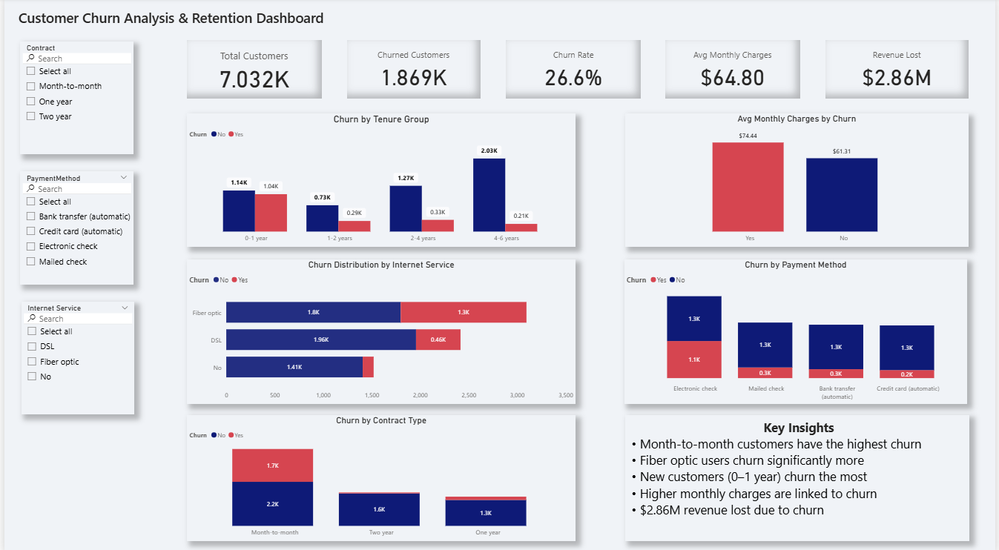

# Customer Churn Analysis & Retention Dashboard

##  Project Overview
This project analyzes customer churn behavior in a telecom company to identify key factors driving customer attrition and its impact on revenue.

##  Objectives
- Analyze customer churn patterns
- Identify key drivers of churn
- Measure revenue impact
- Provide recommendations

##  Dataset
The dataset includes:
- Customer demographics
- Contract type
- Payment method
- Monthly and total charges
- Churn status

##  Tools & Technologies
- Python (Pandas)
- Power BI

##  Data Cleaning
- Converted TotalCharges to numeric
- Removed missing values
- Created tenure groups

##  Key Insights
- Month-to-month customers have the highest churn
- Fiber optic users churn more
- New customers churn the most
- High charges increase churn
- $2.86M revenue associated with churn

##  Dashboard Features
- KPI Cards
- Interactive filters
- Multiple churn analysis visuals

##  Dashboard Preview

##  Recommendations
- Promote long-term contracts
- Improve onboarding
- Encourage automatic payments

##  Conclusion
This project demonstrates how data can be used to reduce churn and improve business decisions.
