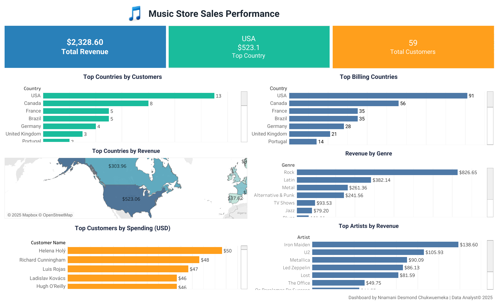

# Music Store Analysis (SQL + Tableau)

### 📁 Dataset
The dataset is from the open-source Chinook music store database (SQL).

### 🎯 Objective
Analyze customer spending behavior, revenue by genre, and top-performing countries.

### ⚙️ Tools Used
- MySQL for querying
- Tableau for visualization

### 🧠 Steps
1. Imported and explored data in MySQL  
2. Wrote queries to calculate total revenue, top customers, and genre revenue  
3. Exported query results to CSV  
4. Built interactive Tableau dashboard  

### 📈 Dashboard Snapshot

### 🔑 Insights
- Total revenue: **$2,328**  
- USA is the top billing country  
- Rock and Latin genres generated the highest sales  
- Interactive map filter enables country-level insights

### 📁 Files
- [🧮 SQL Query Script](./MusicStore_Queries.sql)
- [📊 Exported CSV Files](./Top_Customers_By_Spending.csv)
- [📈 Tableau Workbook File](./MusicStore_Dashboard.twb)
- [🖼️ Dashboard Preview](./dashboard_preview.png)

🔗 [View Interactive Tableau Dashboard](https://public.tableau.com/app/profile/chukwuemeka.nnamani3101/viz/MusicStoreSalesPerfrmance/Dashboard2)
